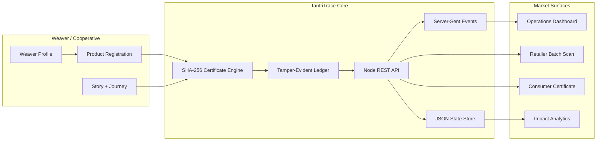
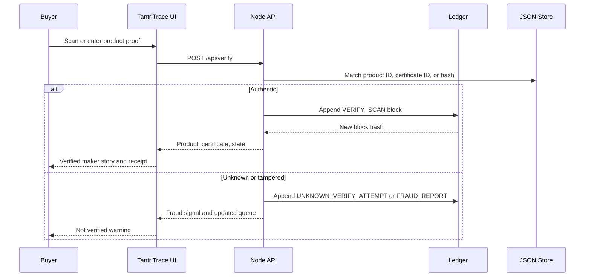
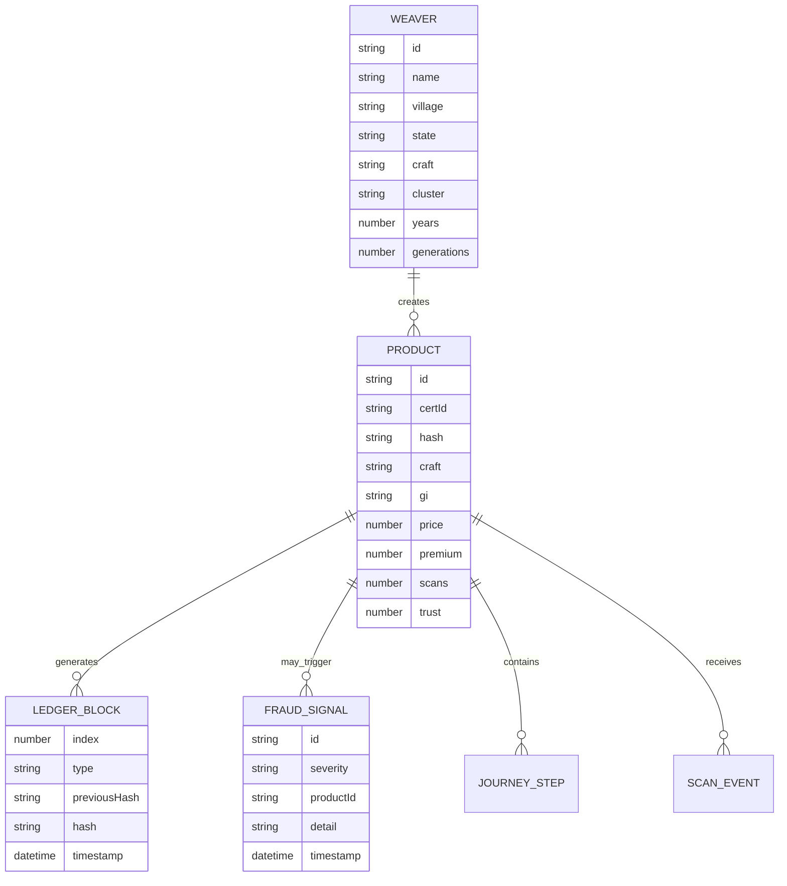
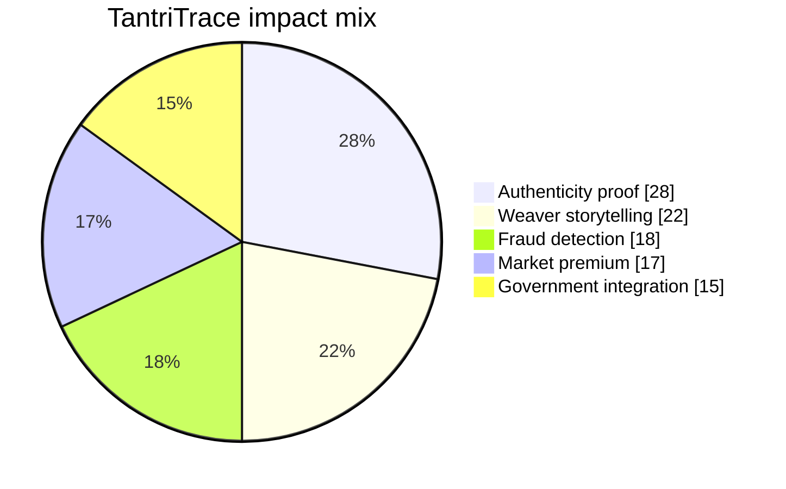
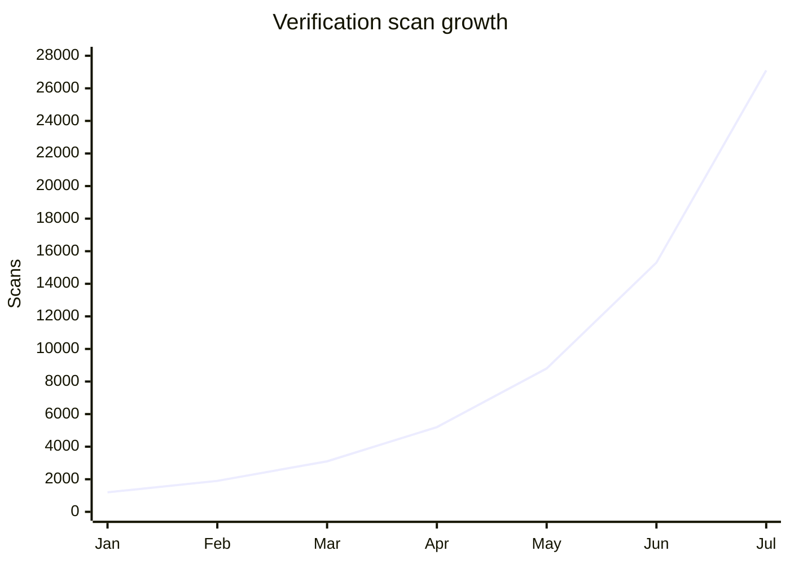

# TantriTrace

India-first handloom authenticity, weaver story, QR-style verification, fraud intelligence, and buyer impact platform for Handloom Hackathon 2026.


<p align="center">
  
  
  
  
  
</p>

## Executive Summary

TantriTrace solves a real market problem: authentic handloom products often lose maker identity, verified craft proof, and fair value once they leave the loom. The platform creates an item-level digital certificate, connects the buyer to the named weaver, records scans in a tamper-evident ledger, and surfaces fraud risk for retailers and cooperatives.

It is built for **Theme 2.2: Digital Authenticity and Weaver Stories** under Market Access and Digital Integration.

## Live Prototype

```bash
npm run serve:prototype
```

Open:

```text
http://127.0.0.1:8790/tantritrace-ultimate/
```

Default verification input:

```text
TT-PCH-001
```

## Vercel Deployment

This repository includes `vercel.json` for a static Vercel deployment.

| Setting | Value |
|---|---|
| Framework Preset | Other |
| Build Command | Managed by `vercel.json` |
| Output Directory | `public` |
| Root Redirect | `/` -> `/tantritrace-ultimate/` |
| Runtime API | Local Node prototype via `npm run serve:prototype`; deployed frontend falls back to browser-local state if `/api` is unavailable |

Deploy from GitHub by importing `sleader3221-dot/Tantri_Trace` into Vercel. The static app works without installing dependencies because the production prototype files already live under `public/tantritrace-ultimate/`.

## What Makes It Submission-Ready

| Judge Lens | TantriTrace Evidence | Working Prototype Surface |
|---|---|---|
| Best Prototype | End-to-end product registration, scan verification, consumer certificate, risk queue, analytics, API, PWA cache | Operations, Consumer, Verify, Registry, Ledger, Analytics, Impact |
| Weaver Impact | Product proof keeps the weaver name attached to retail and export value | Weaver portfolio, buyer impact receipt, income lift metrics |
| Scalability | Same certificate, ledger, and cluster model works across handloom clusters and adjacent craft sectors | Generic product/weaver schema and REST API |
| Market Access | QR-style scan converts anonymous textile sale into authenticated story and premium proof | Consumer certificate and share link |
| Fraud Control | Unknown IDs, tamper mismatches, duplicate-scan pressure, and manual fraud reports are captured | Fraud queue, risk score, ledger blocks |
| Government Fit | API-ready data model for cooperatives, GI verification, Handloom Mark style records, and registry export | JSON export and `/api/*` endpoints |

## Product Screens

| View | Purpose | Key Interactions |
|---|---|---|
| Operations | Control center for product scan, live feed, certificate, and KPIs | Select product, verify trace, run tamper check |
| Verify | Manual authenticity desk and fraud triage | Verify by product ID, certificate ID, or hash |
| Consumer | Public buyer-facing certificate and story | Copy share link, listen to story, download receipt |
| Registry | Create new item-level product proof | Register product, generate stronger story, hash certificate |
| Weavers | Build maker profiles and link them to products | Register weaver, view portfolio and projected income lift |
| Ledger | Recalculate and inspect tamper-evident blocks | Verify chain integrity and export API payload |
| Analytics | Scan, craft, premium, and anomaly charts | Inspect demand, risk, and cluster performance |
| Impact | Cluster intelligence and submission readiness | Measure protected premium, labor days, and scale signals |
| Integrations | API and capability map | Review production integration contract |

## System Architecture



## Verification Flow



## Data Model



## Integrated Charts

### Prototype Value Mix



### Verification Growth Model



### Capability Coverage

| Capability | Status | Implementation |
|---|---:|---|
| Product certificate hashing | Complete | Web Crypto SHA-256 in browser, Node crypto on backend |
| Tamper-evident ledger | Complete | Previous-hash chain with recalculation endpoint |
| Real-time sync | Complete | Server-Sent Events over `/api/events` |
| Durable local server state | Complete | `data/tantritrace-state.json` |
| Offline fallback | Complete | `localStorage` plus PWA service worker cache |
| Consumer story page | Complete | Public certificate, share URL, read-aloud story |
| Retailer batch scan | Complete | Batch verification and risk scoring |
| Fraud workflow | Complete | Unknown verify, tamper check, manual report API |
| Analytics | Complete | Scan trend, craft coverage, premium lift, risk chart |
| Submission docs | Complete | `README.md` and `SUBMISSION.md` |

## Tech Stack

| Layer | Technology | Why It Was Chosen |
|---|---|---|
| Product UI | HTML5, CSS3, Vanilla JavaScript | Fast, portable, dependency-light, works in hackathon judging environments |
| Live backend | Node.js native `http` server | No framework lock-in, easy to inspect, easy to run |
| Crypto proof | Web Crypto API and Node `crypto` | Real SHA-256 hashing without external services |
| Real-time | Server-Sent Events | Simple, reliable, browser-native live updates |
| Persistence | JSON state store | Transparent demo data that judges can inspect |
| Offline mode | `localStorage`, Web Manifest, Service Worker | Useful for rural/low-bandwidth demo conditions |
| App shell | TanStack/Lovable project wrapper | Existing project structure preserved |
| Visual analytics | Inline SVG, CSS bars, Mermaid docs | No fragile chart runtime dependency |

## API Reference

| Method | Endpoint | Purpose |
|---|---|---|
| `GET` | `/api/health` | Check live server status |
| `GET` | `/api/state` | Read full registry state |
| `PUT` | `/api/state` | Persist full synchronized state |
| `GET` | `/api/events` | Subscribe to live SSE state updates |
| `POST` | `/api/scan` | Record a product scan |
| `POST` | `/api/verify` | Verify product ID, certificate ID, or hash |
| `POST` | `/api/products` | Register and hash a product |
| `GET` | `/api/products/{id}/certificate` | Read public certificate payload |
| `POST` | `/api/weavers` | Register a weaver profile |
| `GET` | `/api/ledger/verify` | Recalculate ledger integrity |
| `POST` | `/api/fraud/report` | Submit suspicious scan report |
| `POST` | `/api/reset` | Restore clean seeded demo state |

## Validation Matrix

| Check | Result |
|---|---|
| `node --check server.mjs` | Pass |
| `node --check public/tantritrace-ultimate/app.js` | Pass |
| `node --check public/tantritrace-ultimate/sw.js` | Pass |
| App page HTTP response | `200` |
| JS, CSS, manifest, service worker, favicon responses | `200` |
| `/api/health` | `200` |
| `/api/ledger/verify` | Valid |
| Clean seeded state | 6 products, 6 weavers, 7 ledger blocks, 0 fraud records after `/api/reset` |

## Project Structure

```text
.
|-- README.md
|-- SUBMISSION.md
|-- server.mjs
|-- package.json
|-- data/
|   `-- .gitkeep
|-- public/
|   |-- favicon.svg
|   |-- assets/
|   |   `-- tantritrace-hero.png
|   `-- tantritrace-ultimate/
|       |-- index.html
|       |-- styles.css
|       |-- app.js
|       |-- manifest.webmanifest
|       `-- sw.js
`-- src/
    `-- TanStack/Lovable wrapper routes and UI primitives
```

`data/tantritrace-state.json` is created automatically at runtime and ignored by git so scan/reset activity does not pollute commits.

## Demo Script

1. Open Operations and verify `TT-PCH-001`.
2. Run tamper check to show fraud detection.
3. Open Consumer and copy the public certificate link.
4. Use Verify with an unknown value to create a suspicious attempt.
5. Run Retailer batch scan to update the risk model.
6. Open Ledger and re-verify chain integrity.
7. Open Impact to show cluster value, labor visibility, and scale readiness.

## Why This Can Win

TantriTrace is not a generic marketplace. It is a trust layer for handloom commerce. It turns every textile into a verifiable story, gives weavers a persistent identity in the value chain, protects buyers from counterfeits, gives retailers a scan workflow, and gives government or cooperatives an API-ready registry model.

The strongest demo moment is simple: one scan proves who made the product, where it came from, how it was made, why it is authentic, and what impact the purchase creates.
